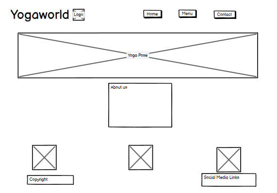
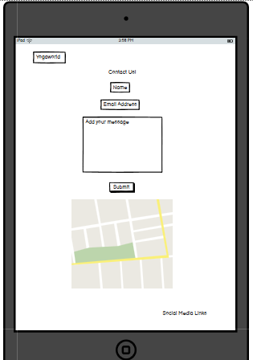

# Yogaworld Website 
Yogaworld is a fictional Yoga Studio that provides Yoga classes for the people of Jump Village Barnsley. Their motto is to exercise and empower through keeping the body supple. The site's target audience is everyone who wants to join a yoga class, people trying to try new things and those who want to promoto healthyness through exercise. The website is a great place book into the studio and book a session 
)
* [Design](#design )
* [Wireframe](#wireFrame)
* [Features](#features)
* [Testing](#testing)
* [Deployment](#deployment)
* [Credits](#credits)

* ## User Experience and Interface(UX/UI) 
#### First Time Visitor Goals  
+ As a first time visitor to the site, I want to be able to easily recognise what the business is about and who it is for.
+ The first time I use the site, I would like to be able to find it easy to navigate through the site to find more content using familiar web assets such as link placements and icons.
+ I would like to be able to see a menu of classes being offered to see if they appeal to me and if they suit my ability level in yoga.  
+ I would like to see where the studio is situated and get directions.

+ #### Returning Visitor Goals  
+ As a returning visitor, I would like to check for any new classes offered.
+ I would like to be able to check if new classes have been added.
+ I want to be able to find the best way to contact the business for questions that i have.
+ I would like to contact the business to leave some positive feedback.  
****
## Design  
### Colour Scheme
+ I chose to use a light pink and green and brown for the yoga studios colour scheme. I feel this will give it an earthy healthy vibe
+ According to my research these colors are often used on yoga websites
+ I wanted to use the color green to promote a healthy feel to the site
### Typography
+ I used Poppins as the main font.
+ ## WireFrame
I used the Balsamic website to create the wireframe for the yogaworld website. Having decided on the Strategy, Scope and Structure planes, I set about planning its Skeleton and what would become my vision of the Surface Plane.
* Home Page WireFrame (Windows)

* Menu Page WireFrame (IPhone)

* Contact Page WireFrame (IPad)

## Features
#### Navigation
The page's navigation Bar is situated at the top of the screen.  It is the same on all pages. It appears on all pages, so the user has no need to use the back button.
  * The Links are situated on the top right of the page and will navigate the user to the Home Page, the Classes Page and the Contact Page.
    * The active page link has an underline and background colour for user clarity as to what page they are on at the moment.
  * The Yogaworld name logo is situated on the top left of the page and is also a link back to the top of the Home Page if clicked.

  * #### Landing Page

The Home/Landing page is an easy on the eye web page. 
  * About Us Section
    * The About us Section gives a brief description of the business, what classes are available and a link to the contact form page.
  Below that are some extra bullet points to note, in the form of images, to reduce reading time thus giving the user a more positive experience of learning about the business.
  * Ashtanga Classes
  * Pregnant Yoga Classes
  * Postnatal Yoga Classes
  * Information Section
    * The information section outlines the studio's opening hours and a Google Map for directions to the shop.
  * Footer Section
    * The Footer, identical on each page, shares links to the Yoga studio's social media sites for added engagement. When clicked, the links will open in a new tab to allow easy user navigation.  It also contains the site's name and copyright icon.
   
    * #### Classes Page

The classes page will allow users to view the yoga studio's classes available. 
  * Each class has it's name and price clearly visible, and user's can click on the plus(+) button to drop down details of the class / session.
This effectively reduces the page content significantly, which gives a more positive user experience than having to scroll through a long list of items.
  * There are three images displayed on the page. Giving the customer a selection of classes

  * #### Contact Page

  
  The Contact page will allow users to fill out a clear and simple-to-use form with their information and space to add a brief message.  
  They will be required to check the terms and conditions box.
  
  There is also a section on how they came across our page, which is not a requirement to choose, but will help with our own data analysis. 
  Below the contact form is another copy of Google Map Section on where the studio is located.
  * When the user clicks the Submit button, they are brought to a Thank You page with a short message confirming their form has been received successfully.
  * 
  

## Future Features
  * dynamic schedule bookings
  * online yoga classes
## Testing
The website has been tested on Google Chrome, Safari and Firefox and all rendered successfully.

  | Action: | Expected Result: | Pass/Fail: |
  |:---|:---|:---|
  | Enter URL/Click Link | Landing Page | Pass |

  ## Validator Testing
  * HTML
    * Not yet tested

  * CSS
    * Not yet checked

  * Lighthouse
    * The website not yet scored

  * Wave
    * not yet checked for errors
    

### Solved Bugs
* Form not submitting successfully
  * I put the form into separate Div's and changed the ID to match the Submit Button.
* Parse error in CSS Validation
  * Move Google fonts link to bottom of Style Sheet.

### Unfixed Bugs
  * There are no unfixed bugs

## Deployment
The Yogaworld site was deployed to GitHub pages. The steps to deploy are as follows:
1. In the GitHub repository, navigate to the Settings Tab.
2. From the source section drop-down menu, select the Master Branch.
3. Once this is selected, the page will be automatically refreshed with a detailed ribbon display to indicate successful deployment.
The live link can be found on GitHub ***no site as yet ***
#### Local Deployment
The steps to clone this project to create a local copy are as follows:
1. In GitHub.com, go to the main page of the repository.
2. Click on the green code button.
3. Copy the URL for the repository
4. Open the terminal in the location you wish the repository to be cloned.
5. Type `git clone` and then paste the URL

## Credits
### Content
* Favicons: Created in gimp [https://www.gimp.org/downloads/]
* Icons for Logo & Footer: [Font awesome website](https://fontawesome.com)
* Google Maps: [Google Maps website](https://www.google.com/maps)
* Menu Content: [Yoga at the reach website] (https://www.yogaatthereach.com/schedule)
* C.I Love Running - Help and Inspiration for Nav Bar
* Info on how to change the default details icon on menu page [Mdn Webdocs](https://developer.mozilla.org/en-US/docs/Web/HTML/Element/details)
### Media
* Images: [Free Images Website](https://www.freeimages.com/)
* Fonts: [Google Fonts website](https://fonts.google.com/)
* Sale Gif: [Giphy website](https://giphy.com/explore/free)
